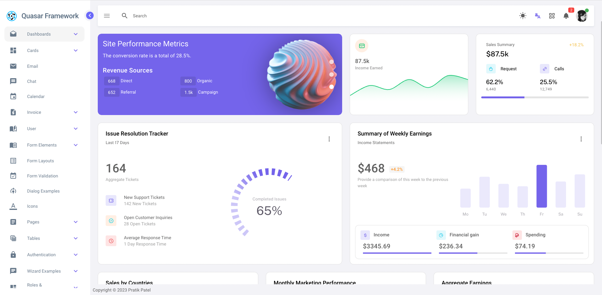
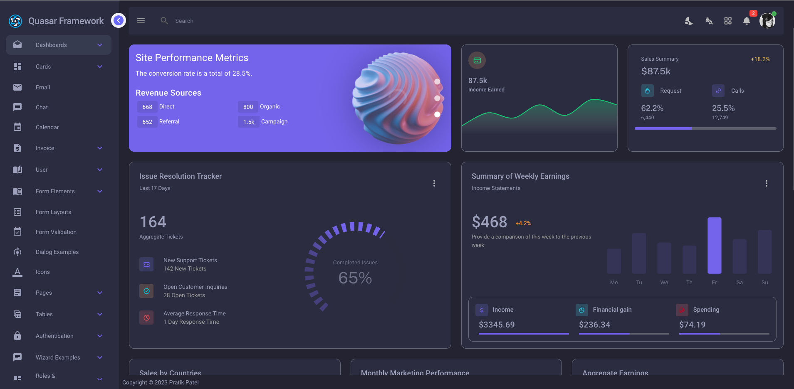
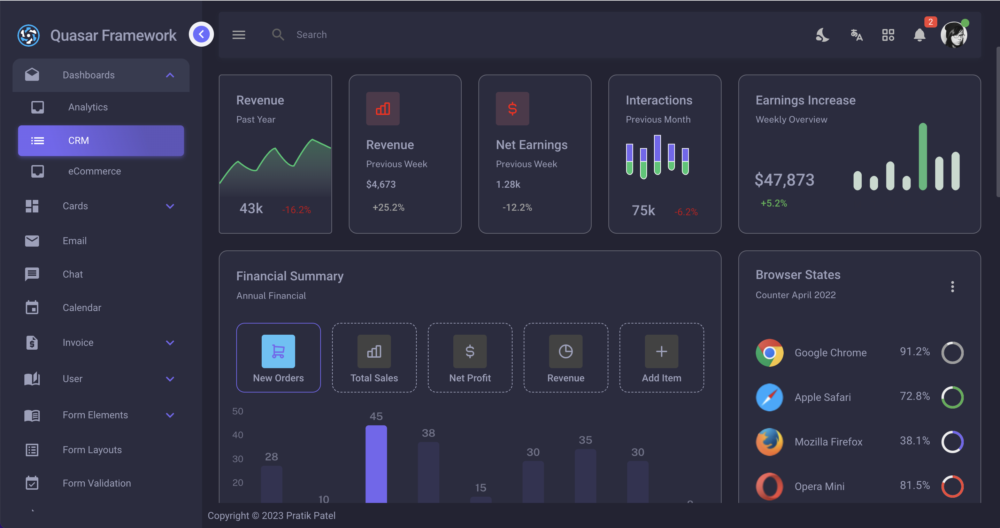
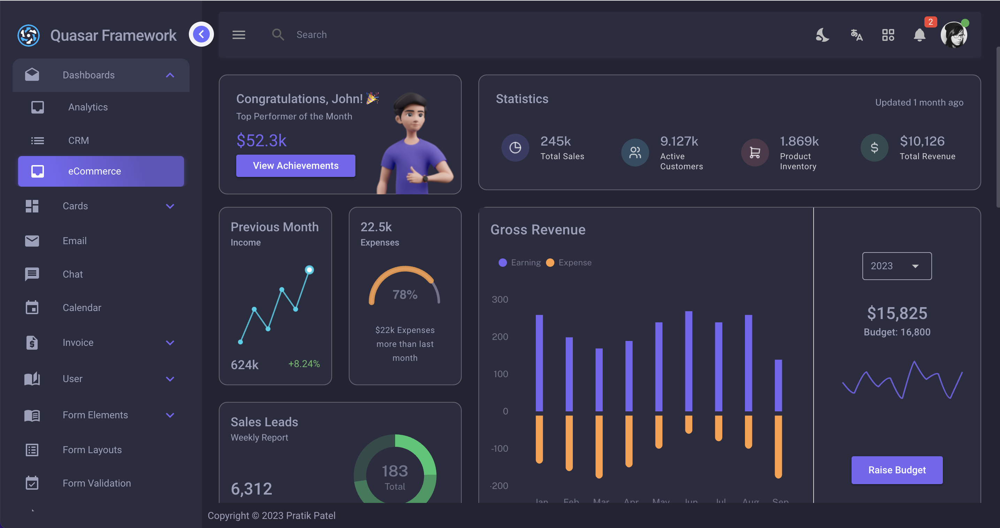
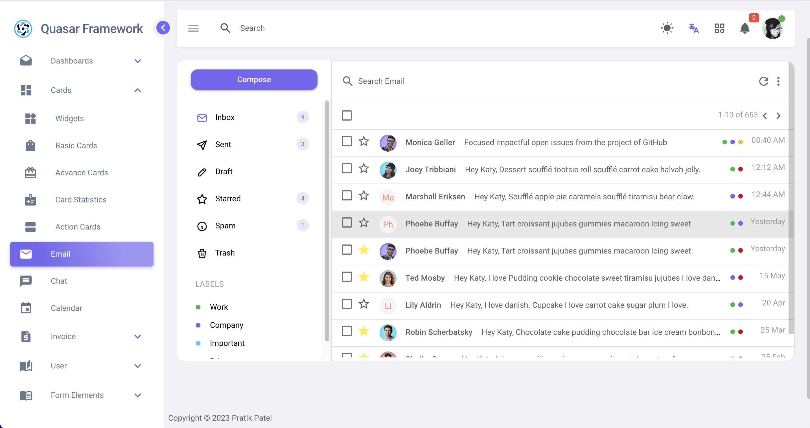
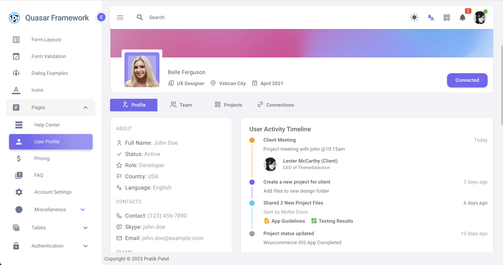

# Quasar Prime Admin Template

## Proudly serving over 9+ happy customers and counting! 🚀🚀🚀

Introducing Quasar Prime Admin Template – Your Ultimate Solution for a Powerful and Elegant Dashboard!

Quasar Prime Template – Empowering Developers with an Exceptional Vue.js Admin Dashboard

Unlock the full potential of your development projects with the Quasar Prime Template – a Vue.js Admin Dashboard that
sets the standard for developer-friendly interfaces. Meticulously crafted to adhere to the highest industry standards,
this template combines speed, usability, and scalability, providing an unparalleled foundation for creating dynamic and
customizable admin dashboards.

    

## Now also available for TypeScript and script setup! 🚀🚀

### Ready to Elevate Your Development Experience?

If you're considering acquiring this powerful template, head over to my sponsorship page (Sponsor Me). Unlock the full
potential of the code by [sponsoring](https://github.com/sponsors/pratik227) for (<strike>$549</strike>)$249 per month(Launching price), a one-time payment that
grants you exclusive access to the
template.

Curious? Check out the live demo at [Quasar Prime Analytics](https://quasar-prime-admin-template.netlify.app/analytics)
to experience the dynamic features and versatility this
template offers.

Elevate your projects with Quasar Prime Template – where minimalist design meets robust functionality.

Why Choose Quasar Prime Template?

1. Developer-Friendly and Highly Customizable:

Tailored for developers, this admin dashboard template offers an intuitive and customizable environment. Adhering to
best practices, it streamlines the development process, ensuring both efficiency and flexibility.

2. Premium Quality Applications Made Easy:

Elevate your applications with Quasar Prime Template's innovative design. Craft visually stunning, high-performing
single-page applications that seamlessly adapt to various devices, including desktops, tablets, and mobiles.

3. Versatility Unleashed:

Whether you're working on SaaS platforms, project management tools, e-commerce backends, CRM systems, fitness apps,
analytics platforms, or education applications, Quasar Prime Template empowers you to build diverse web applications
effortlessly.

4. Ready-to-Use Templates and Applications:

Jumpstart your projects with pre-built templates and 10 carefully designed applications, including Email, Chat,
Calendar, eCommerce, Invoice, User Management, Roles & Permissions, Front-Pages, Maps, and Charts.

5. Quick Start with Documentation:

Boasting user-friendly features, Quasar Prime Template ensures a swift start to your development journey. Two niche
dashboards and a well-documented starter kit provide a seamless experience from the outset.

6. Free Lifetime Updates:

Your purchase of Quasar Prime Template comes with an invaluable perk – free lifetime updates. Stay ahead with continuous
enhancements, improvements, and new features, ensuring your admin dashboard remains cutting-edge.

### In summary, Quasar Prime Template is more than an admin dashboard; it's a dynamic toolkit designed to empower developers in creating exceptional, scalable, and visually striking web applications. Experience the difference with Quasar Prime Template – where innovation meets ease of use.

# Screenshots

1. Dashboard

Dark Mode

2. CRM

3. Ecommerce

4. Email

5. Profile

